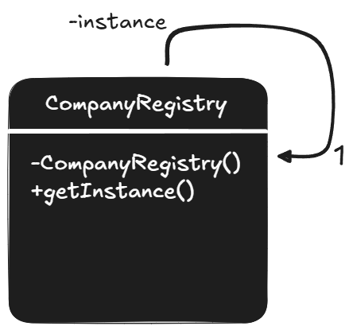

## Descrição

O **padrão Singleton** é um padrão de projeto criacional que assegura que uma classe tenha apenas uma **única instância** e oferece um ponto de acesso global a essa instância. Tal padrão pode ser utilizado em cenários que exigem um controle centralizado de recursos, como no gerenciamento de configurações, conexões com bancos de dados e sessões de usuários. O padrão é especialmente útil quando a criação de múltiplas instâncias de uma classe pode gerar problemas, como o consumo excessivo de recursos ou a inconsistência nos dados.

## Utilização no Exemplo

No exemplo apresentado, a classe `CompanyRegistry` segue o padrão Singleton para garantir que apenas uma instância da classe seja criada e utilizada ao longo da aplicação.
## Aluno

- **Nome:** João Vitor Amorim Lopes
- **Matrícula:** 0900043180
- **Curso:** Sistemas de Informação